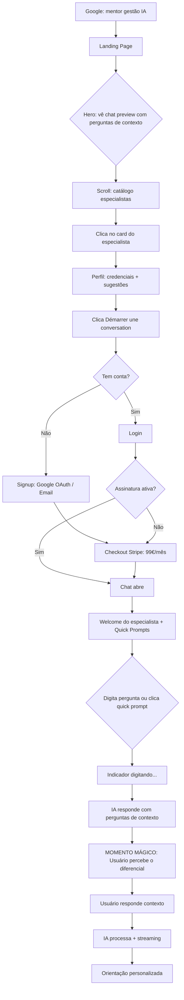
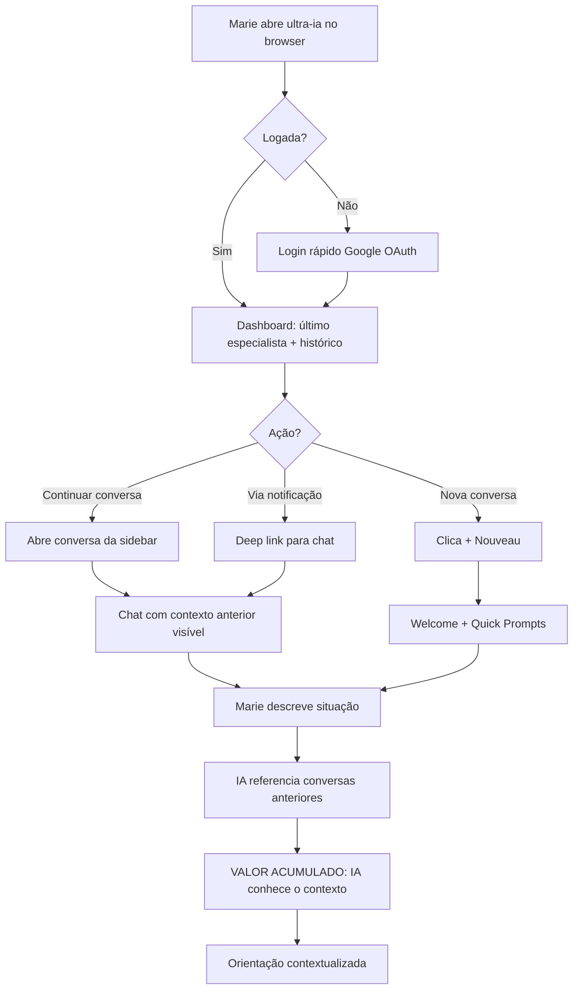
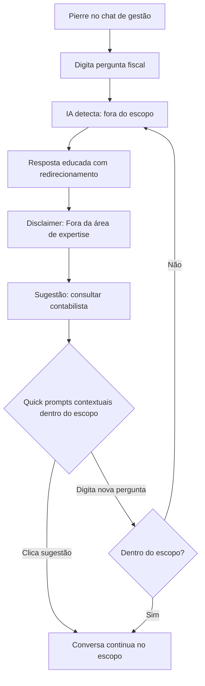
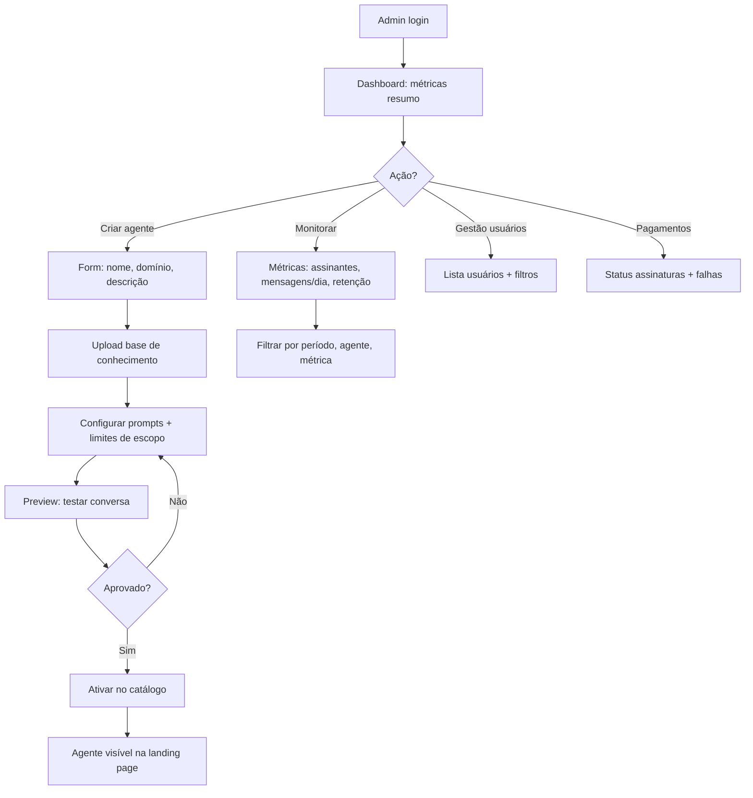
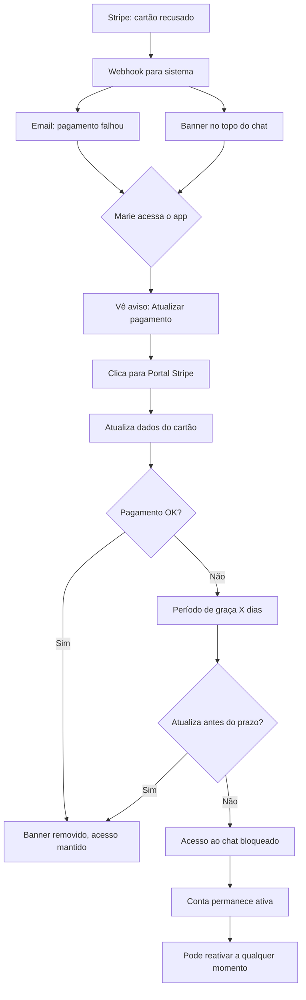

# UX Design Specification ultra-ia

**Author:** Vinicius
**Date:** 2026-03-10

---

## Executive Summary

### Project Vision

O ultra-ia é uma plataforma SaaS premium (~100€/mês) que oferece agentes IA especialistas verticais para o mercado francês e europeu. O primeiro nicho é mentoria em gestão empresarial. O diferencial central da experiência é que a IA desafia o usuário com perguntas de contexto antes de aconselhar — replicando o comportamento de um consultor real. A plataforma é construída com Next.js + ShadCN UI, design desktop-first com suporte mobile via browser, interface em francês.

A referência visual principal é o Chatify.fr: estética minimalista, paleta dominada por preto/branco com cores de acento por especialista, tipografia moderna (Inter/Poppins), cards com fotos profissionais, whitespace generoso e posicionamento premium acessível.

### Target Users

**Pierre (Solopreneur):** 34-45 anos, empreendedor solo em cidades francesas. Tech-savvy profissional mas não técnico. Usa predominantemente à noite, sozinho, busca profundidade e orientação sem julgamento. Necessita de interface intuitiva que permita ir fundo nas perguntas sem fricção.

**Marie (Gestora PME):** 38-42 anos, diretora de PME em crescimento. Usa entre reuniões para decisões urgentes. Precisa de acesso rápido, respostas contextualizadas e histórico de conversas organizável. Valoriza eficiência — a interface não pode atrapalhar.

**Admin (Equipe interna):** Gestão completa da plataforma — criação de agentes, upload de base de conhecimento, configuração de prompts, dashboard de métricas, gestão de assinaturas. Necessita de painel funcional e organizado, não necessariamente bonito.

### Key Design Challenges

1. **Chat como core** — A interface de chat é o produto inteiro. Streaming em tempo real, perguntas de contexto da IA, limites de escopo e disclaimers devem coexistir sem interromper o fluxo natural da conversa
2. **Conversão sem trial** — Sem experiência gratuita, a landing page e perfis de especialistas devem comunicar valor suficiente para justificar 100€/mês antes do primeiro uso
3. **Confiança premium** — Cada elemento visual comunica que o serviço vale o preço. Qualidade visual profissional, consistência de marca e clareza nos disclaimers constroem confiança
4. **Responsividade desktop + mobile** — Interface de chat deve funcionar nativamente em ambos os contextos, com adaptações para teclado (desktop) e touch (mobile)
5. **Complexidade admin** — Painel administrativo com múltiplas funcionalidades (dashboard, gestão de agentes, analytics, usuários) precisa ser navegável e funcional

### Design Opportunities

1. **Amplificar o "momento mágico"** — A primeira interação onde a IA faz perguntas de contexto é o diferenciador. O design deve criar expectativa antes e reforço depois desse momento
2. **Histórico como retenção visual** — Tornar visível o contexto acumulado (conversas anteriores, temas abordados) reforça que trocar de serviço = recomeçar do zero
3. **Estética premium como valor** — Design minimalista inspirado no Chatify (paleta clean, whitespace generoso, tipografia moderna, cards profissionais) justifica visualmente o posicionamento de preço

## Core User Experience

### Defining Experience

A experiência central do ultra-ia é a **conversa com o especialista IA**. O loop principal é: usuário faz pergunta → IA responde com perguntas de contexto → diálogo aprofundado → orientação personalizada. Este loop representa 100% do valor do produto — se a experiência de chat for excelente, o produto é excelente.

O produto é exclusivamente online (sem funcionalidade offline) e inclui sistema de notificações (email/push) para reengajamento e alertas de pagamento.

### Platform Strategy

- **Plataforma:** Web browser (desktop + mobile responsivo)
- **Input primário:** Teclado (desktop) + touch/teclado virtual (mobile)
- **Sem offline:** Produto depende de IA em tempo real — conexão obrigatória
- **Notificações:** Email para reengajamento, alertas de pagamento, e lembretes de uso. Push notifications no browser para retorno rápido
- **Quick prompts:** Sugestões de perguntas clicáveis na primeira conversa, ao iniciar nova conversa, e contextualmente baseadas no domínio do especialista

### Effortless Interactions

1. **Chat → Conversa:** Abrir o chat e começar a conversar com zero cliques desnecessários entre login e primeira mensagem
2. **Histórico:** Sidebar sempre acessível com lista de conversas anteriores, busca rápida por tema/data
3. **Quick prompts:** Sugestões clicáveis que reduzem a barreira de "o que perguntar" — especialmente para novos usuários
4. **Streaming:** Resposta da IA aparece palavra por palavra com indicador visual de "digitando", eliminando espera silenciosa
5. **Nova conversa:** Um clique para iniciar nova conversa, mantendo histórico intacto
6. **Notificações → Chat:** Da notificação ao chat ativo em um toque/clique

### Critical Success Moments

1. **Momento mágico (primeira conversa):** Usuário faz pergunta genérica, IA responde com perguntas de contexto inteligentes. Este é O momento definidor — se falhar aqui, o produto falha. O design deve criar expectativa (landing page mostra exemplos) e reforço (interface destaca a natureza única da interação)
2. **Valor acumulado (semana 3):** Usuário percebe que a IA referencia conversas anteriores e conhece seu contexto. O histórico visível reforça que trocar = recomeçar do zero
3. **Decisão de renovação (mês 2):** Interface deve tornar tangível o valor recebido — conversas realizadas, insights obtidos, progresso do usuário
4. **Retorno via notificação:** Notificação bem escrita traz o usuário de volta ao chat, reforçando o hábito de uso recorrente

### Experience Principles

1. **Conversa primeiro, tudo depois** — Cada decisão de design prioriza a fluidez do chat. Nada deve interromper ou competir com a conversa em andamento
2. **Premium sem complexidade** — Visual sofisticado com interações simples. A qualidade está na simplicidade, não na quantidade de features visíveis
3. **Contexto acumulado = valor visível** — O histórico de conversas e o conhecimento da IA sobre o usuário devem ser visualmente tangíveis e facilmente acessíveis
4. **Acesso instantâneo** — Do login ao chat em 1 clique. Das notificações à conversa em 1 toque. Toda fricção desnecessária é eliminada

## Desired Emotional Response

### Primary Emotional Goals

1. **Compreendido e apoiado** — O usuário sente que tem um consultor dedicado que realmente entende sua situação específica. A IA fazendo perguntas de contexto antes de responder cria a sensação de ser ouvido — algo que Pierre busca na solidão do empreendedorismo e Marie busca na pressão de decidir sozinha
2. **Confiança para decidir** — Após cada conversa, o usuário sai mais seguro para agir. A orientação contextualizada transforma incerteza em clareza
3. **Surpresa positiva** — "Espera, esta IA é diferente." O momento onde a IA desafia com perguntas em vez de dar respostas genéricas gera diferenciação emocional imediata

### Emotional Journey Mapping

| Momento | Emoção Desejada | Como o Design Suporta |
|---------|----------------|----------------------|
| Descoberta (landing page) | Curiosidade + Credibilidade | Visual premium, exemplos de conversas reais, perfil profissional do especialista |
| Primeiro contato (signup) | Segurança + Expectativa | Processo simples, messaging claro sobre o que esperar |
| Primeira conversa | Surpresa + "Isso é diferente" | IA faz perguntas de contexto, streaming fluido, quick prompts para começar |
| Uso recorrente (semanas 1-3) | Apoio + Progresso | Histórico acessível, IA referencia contexto anterior, sidebar organizada |
| Renovação (mês 2) | Valor tangível + Indispensabilidade | Contexto acumulado visível, percepção de que trocar = recomeçar do zero |
| Erro/Limite atingido | Respeito + Transparência | Mensagem educada de limite, disclaimer honesto, redirecionamento construtivo |

### Micro-Emotions

**Priorizar:**
- **Confiança > Ceticismo** — Disclaimers honestos, redirecionamento para humanos em temas sensíveis, e consistência nas respostas constroem confiança progressiva
- **Intimidade > Artificialidade** — Tom conversacional da IA, perguntas genuínas de contexto, e streaming palavra por palavra criam sensação de conversa real
- **Empoderamento > Dependência** — A IA orienta para que o usuário tome a decisão, não decide por ele

**Evitar:**
- **Frieza de máquina** — A interação nunca deve parecer transacional ou robótica
- **Desconfiança** — "Será que posso confiar neste conselho?" — disclaimers e escopo claro previnem isso
- **Frustração com limites** — Limite de 100 req/dia comunicado com elegância, não como bloqueio

### Design Implications

| Emoção Desejada | Decisão de Design |
|----------------|-------------------|
| Compreendido | IA sempre faz perguntas antes de responder. Nunca resposta genérica imediata |
| Confiança | Disclaimers integrados naturalmente (não pop-ups invasivos). Redirecionamento educado fora do escopo |
| Surpresa positiva | Landing page com exemplos de conversas reais mostrando o diferencial. Primeira interação deve impressionar |
| Intimidade | Streaming palavra por palavra. Avatar/foto do especialista presente no chat. Tom de conversa, não de relatório |
| Segurança | Design premium clean, whitespace generoso, tipografia profissional — nada de "chatbot barato" |
| Transparência | Limite de mensagens mostrado de forma sutil (barra de uso), não como countdown agressivo |

### Emotional Design Principles

1. **Humano primeiro, IA depois** — Toda interação deve parecer uma conversa com um profissional experiente, não com um algoritmo. O design visual e o tom reforçam humanidade
2. **Confiança se constrói, não se declara** — Disclaimers honestos, escopo claro e respostas consistentes constroem confiança organicamente. Nada de "Confie em nós!" — mostrar, não dizer
3. **Limites com elegância** — Quando a IA atinge limites (escopo, mensagens/dia), a experiência deve ser respeitosa e construtiva, nunca punitiva
4. **Valor sentido, não apenas entregue** — O design deve tornar tangível o valor acumulado (histórico, contexto, insights) para que o usuário sinta o progresso

## UX Pattern Analysis & Inspiration

### Inspiring Products Analysis

**1. Chatify.fr — Referência Direta**
- **O que faz bem:** Cards de especialistas com foto profissional, cor de acento por expert, sugestões de perguntas com emoji, CTA "Chat" direto. Landing page com hero impactante ("AI from the best experts"). Estética minimalista preto/branco com cores por especialista
- **Padrão de sucesso:** Cada especialista tem identidade visual própria (cor de acento) dentro de um sistema coeso. Perfil profissional com credenciais visíveis constrói confiança antes do primeiro uso
- **O que traz o usuário de volta:** Perfil do especialista como âncora — o usuário volta para "seu" consultor, não para "a plataforma"

**2. ChatGPT — Benchmark de Chat IA**
- **O que faz bem:** Sidebar com histórico de conversas, streaming palavra por palavra, input de texto simples e proeminente, transição fluida entre conversas, "Nova conversa" sempre acessível
- **Padrão de sucesso:** A área de chat ocupa 100% do espaço útil. Nada compete com a conversa. Sidebar colapsável libera espaço no mobile
- **O que traz o usuário de volta:** Histórico acumulado + facilidade de retomar de onde parou

**3. Notion — Referência SaaS Premium**
- **O que faz bem:** Sidebar com hierarquia clara, whitespace generoso, tipografia bold para headings com body copy leve, card-based layout, navegação por categorias sem sobrecarga cognitiva
- **Padrão de sucesso:** Organização modular — cada seção é autocontida. Sidebar como hub de navegação principal, conteúdo como foco central
- **O que traz o usuário de volta:** Workspace pessoal acumulado — trocar = perder tudo

### Transferable UX Patterns

**Navigation Patterns:**
- **Sidebar colapsável (ChatGPT)** → Histórico de conversas no ultra-ia. Colapsável no mobile, sempre visível no desktop
- **Hierarquia por categorias (Notion)** → Painel admin com seções claras (Dashboard, Agentes, Usuários, Analytics)

**Interaction Patterns:**
- **Streaming palavra por palavra (ChatGPT)** → Core da experiência de chat do ultra-ia. Indicador "digitando" durante processamento
- **Sugestões clicáveis com emoji (Chatify)** → Quick prompts na primeira conversa e ao iniciar nova conversa
- **Input proeminente (ChatGPT)** → Caixa de texto sempre visível na base do chat, foco automático

**Visual Patterns:**
- **Cor de acento por especialista (Chatify)** → Cada agente tem identidade visual própria dentro do sistema ultra-ia
- **Whitespace generoso + tipografia bold (Notion)** → Landing page e perfis de especialistas com respiro visual
- **Card-based profiles (Chatify)** → Catálogo de especialistas na landing page com foto, credenciais e CTA

### Anti-Patterns to Avoid

1. **ChatGPT sem identidade** — Respostas genéricas sem avatar ou personalidade. ultra-ia deve ter foto/avatar do especialista presente em toda conversa
2. **Chatbots corporativos** — Pop-ups de chat no canto inferior com animação irritante. ultra-ia é uma experiência de tela cheia, não um widget
3. **Onboarding longo** — Tutoriais de 5 passos antes de usar. ultra-ia deve levar ao chat em máximo 2 cliques após signup
4. **Limites punitivos** — Countdown agressivo de "3 mensagens restantes". Limites devem ser sutis e respeitosos
5. **Sidebar sempre aberta no mobile** — Rouba espaço do chat. Deve ser colapsável/overlay no mobile

### Design Inspiration Strategy

**Adotar:**
- Sidebar de conversas estilo ChatGPT (histórico, busca, nova conversa)
- Cards de especialistas estilo Chatify (foto, credenciais, cor de acento, sugestões)
- Whitespace e tipografia estilo Notion (respiro visual, hierarquia clara)
- Streaming palavra por palavra estilo ChatGPT (core do chat)

**Adaptar:**
- Perfil de especialista do Chatify → adicionar exemplos de conversa real para mostrar o diferencial das perguntas de contexto
- Sidebar do ChatGPT → adicionar avatar do especialista e categorização por tema nas conversas
- Layout do Notion → simplificar para o admin panel (menos flexibilidade, mais foco)

**Evitar:**
- Visual genérico de chatbot (widget no canto, sem personalidade)
- Complexidade do Notion (ultra-ia não precisa de flexibilidade infinita — é focado em chat)
- Frieza do ChatGPT (sem identidade visual de quem está do outro lado)

## Design System Foundation

### Design System Choice

**ShadCN UI + Tailwind CSS** — Sistema temável com componentes copiáveis e 100% customizáveis, construído sobre Radix UI primitives.

**Categoria:** Sistema Temável — equilíbrio ideal entre velocidade de desenvolvimento e identidade visual única.

### Rationale for Selection

| Fator | Por que ShadCN + Tailwind |
|-------|--------------------------|
| Velocidade MVP | Componentes prontos (Button, Input, Dialog, Card, Avatar, ScrollArea, Sidebar) aceleram dev com equipe de 2-4 pessoas |
| Customização | Componentes são copiados para o projeto, não importados de lib — 100% editáveis para visual premium |
| Consistência | Design tokens via `tailwind.config` (cores, espaçamento, tipografia, border-radius) garantem coesão visual |
| Dark/Light mode | Suporte nativo via CSS variables — ambos os modos disponíveis no MVP |
| Acessibilidade | Radix UI primitives incluem ARIA attributes, keyboard navigation e focus management (WCAG 2.1 A) |
| Stack alignment | Nativo para Next.js App Router — zero configuração extra, RSC compatible |
| Chat components | ScrollArea, Textarea, Avatar, Separator são blocos prontos para a interface de chat |
| Comunidade | Documentação excelente, crescimento rápido, componentes bem testados |

### Implementation Approach

**Estrutura de componentes:**
- `components/ui/` — Componentes ShadCN base (importados e customizados)
- `components/chat/` — Componentes específicos do chat (ChatMessage, ChatInput, StreamingIndicator)
- `components/landing/` — Componentes da landing page (SpecialistCard, Hero, PricingSection)
- `components/admin/` — Componentes do painel admin (Dashboard, AgentManager, MetricsCard)
- `components/layout/` — Layout compartilhado (Sidebar, Header, Footer)

**Design tokens via Tailwind:**
- Cores: paleta base preto/branco + cor de acento por especialista (via CSS custom properties)
- Tipografia: Inter (body) + Poppins (headings) — alinhado com referência Chatify
- Espaçamento: escala consistente de 4px (Tailwind default)
- Border-radius: arredondamento suave (md/lg) para visual premium
- Sombras: sutis para cards e elevação

**Temas:**
- Light mode como padrão (landing page, catálogo)
- Dark mode disponível (preferência do sistema ou toggle manual)
- CSS variables para troca instantânea sem flicker

### Customization Strategy

**Nível 1 — Tailwind Config (Global):**
- Cores primárias, secundárias e de acento
- Tipografia (font-family, font-size scale)
- Breakpoints responsivos (mobile, tablet, desktop)
- Dark mode color mappings

**Nível 2 — Componentes ShadCN (Edição direta):**
- Estilização de Button, Card, Dialog para visual premium
- Avatar com suporte a foto do especialista
- ScrollArea otimizado para chat com streaming
- Sidebar customizado com avatar + histórico de conversas

**Nível 3 — Componentes Custom (Novos):**
- ChatMessage — bolha de mensagem com avatar, timestamp, streaming animation
- StreamingIndicator — animação "digitando" estilo ChatGPT
- SpecialistCard — card de perfil com cor de acento, foto, credenciais
- QuickPrompt — sugestão clicável com emoji
- UsageMeter — indicador sutil de limite diário
- DisclaimerBanner — disclaimer integrado e não invasivo

## Defining Core Experience

### Defining Experience

**Em uma frase:** "Converse com um especialista IA que primeiro entende sua situação, depois orienta."

**O que o usuário descreve ao amigo:** "É tipo um consultor que custa 100€/mês em vez de 300€/hora, tá disponível 24/7, e o melhor — ele faz as perguntas certas antes de te dar conselho. Não é ChatGPT, é outra coisa."

**A interação que define o produto:** O momento onde o usuário digita uma pergunta genérica ("como aumentar meu faturamento?") e a IA responde com perguntas de contexto inteligentes ("Qual seu faturamento atual? Quantos clientes ativos? Qual seu ticket médio?"). Este momento muda a percepção do usuário de "chatbot" para "consultor".

### User Mental Model

**Modelo mental que o usuário traz:**
- **De ChatGPT:** Digito → recebo resposta instantânea. Expectativa de velocidade e formato de chat
- **De consultor humano:** Explico minha situação → recebo orientação contextualizada. Expectativa de profundidade e personalização
- **De WhatsApp:** Conversa fluida, histórico salvo, acesso rápido. Expectativa de familiaridade

**O ultra-ia é um híbrido:** Velocidade e formato do ChatGPT + profundidade do consultor humano + familiaridade do WhatsApp.

**Onde o usuário pode se confundir:**
- Esperar resposta imediata e receber perguntas de volta (primeiras vezes) — precisa de educação sutil na landing page
- Não entender os limites de escopo — disclaimer deve ser claro desde o início
- Esperar que a IA lembre de tudo automaticamente (entre conversas) — a interface deve mostrar quando o contexto anterior está sendo usado

**O que amam nas soluções atuais:** Velocidade do ChatGPT, disponibilidade 24/7
**O que odeiam:** Respostas genéricas, inconsistência, falta de profundidade, preço de consultores

### Success Criteria

| Critério | Indicador de Sucesso | Como Medir |
|----------|---------------------|------------|
| IA faz perguntas relevantes | Usuário responde às perguntas (não abandona) | Taxa de continuação após primeira pergunta de contexto |
| Resposta personalizada | Usuário percebe que a resposta é específica para ele | Feedback qualitativo, tempo na conversa |
| Streaming fluido | Zero sensação de "travou" | Latência < 5s para primeiro token, sem interrupções |
| Acesso rápido | Login → Chat em < 3 cliques | Contagem de cliques, tempo até primeira mensagem |
| Histórico útil | Usuário retorna a conversas anteriores | Taxa de acesso ao histórico |
| Valor percebido | Usuário renova assinatura | Retenção mês 2+ |

### Novel UX Patterns

**Padrão inovador:** A IA que desafia antes de responder é **familiar na dinâmica** (consultor humano faz isso) mas **novo no formato digital** (nenhum chatbot faz isso consistentemente).

**Estratégia:** Combinar padrões estabelecidos com twist inovador:
- **Estabelecido:** Interface de chat (ChatGPT), sidebar de histórico, streaming, input de texto
- **Inovador:** IA responde com perguntas antes de aconselhar, disclaimer integrado naturalmente, redirecionamento educado fora do escopo
- **Educação do usuário:** Landing page mostra exemplos de conversa real com o padrão de perguntas de contexto — o usuário já sabe o que esperar antes de assinar

**Metáfora familiar:** "É como ter um consultor de negócios no bolso" — o usuário entende imediatamente sem explicação técnica.

### Experience Mechanics

**1. Initiation (Início da conversa):**
- Usuário clica "Nova conversa" ou seleciona quick prompt sugerido
- Chat abre com mensagem de boas-vindas do especialista + 3 sugestões clicáveis
- Input de texto com foco automático e placeholder contextual ("Pergunte ao especialista...")

**2. Interaction (Troca de mensagens):**
- Usuário digita pergunta → envia com Enter ou botão
- IA processa (indicador "digitando" com avatar do especialista)
- IA responde em streaming com perguntas de contexto (primeira interação) ou orientação contextualizada (após contexto estabelecido)
- Usuário responde → ciclo continua até resolução
- Cada mensagem tem avatar do remetente (usuário vs especialista) e timestamp

**3. Feedback (Sinais de sucesso):**
- Streaming visual confirma que a IA está processando (não travou)
- Perguntas de contexto da IA sinalizam "estou tentando te entender"
- Respostas que referenciam dados do usuário sinalizam "eu entendi sua situação"
- Disclaimer sutil na base do chat mantém transparência sem interromper

**4. Completion (Fim da sessão):**
- Usuário fecha o chat quando satisfeito — sem "botão de finalizar"
- Conversa é salva automaticamente no histórico com título gerado
- Próxima vez que acessar, a conversa anterior está na sidebar
- Quick prompts sugeridos para nova conversa baseados no contexto anterior

## Visual Design Foundation

### Color System

**Paleta Light Mode:**
- Background: `#FFFFFF`
- Surface: `#F8FAFC`
- Text Primary: `#111827`
- Text Secondary: `#6B7280`
- Primary (Blue): `#2563EB`
- Primary Hover: `#1D4ED8`
- Border: `#E5E7EB`

**Paleta Dark Mode:**
- Background: `#0F172A`
- Surface: `#1E293B`
- Text Primary: `#F1F5F9`
- Text Secondary: `#94A3B8`
- Primary (Blue): `#3B82F6`
- Primary Hover: `#60A5FA`
- Border: `#334155`

**Cores Semânticas:**
- Success: `#10B981` (confirmações, status ativo)
- Warning: `#F59E0B` (alertas, limites próximos)
- Error: `#EF4444` (erros, falhas de pagamento)
- Info: `#3B82F6` (dicas, informações contextuais)

**Cores de Acento por Especialista:**
Cada agente IA tem uma cor de identidade que aparece no avatar, card, e detalhes do chat:
- Gestão Empresarial: `#2563EB` (azul confiança)
- Futuras verticais: paleta expandível com cores distintas por nicho

**Implementação CSS Custom Properties:**
```css
:root {
  --background: 0 0% 100%;
  --foreground: 222 47% 11%;
  --primary: 217 91% 60%;
  --primary-foreground: 210 40% 98%;
}
.dark {
  --background: 222 47% 11%;
  --foreground: 210 40% 98%;
  --primary: 217 91% 60%;
  --primary-foreground: 222 47% 11%;
}
```

### Typography System

**Fontes:**
- **Headings:** Poppins (weight 600, 700) — moderna, profissional, premium
- **Body:** Inter (weight 400, 500, 600) — legibilidade excelente, versátil
- **Code/Mono:** JetBrains Mono — para eventuais dados técnicos

**Type Scale:**

| Nível | Tamanho | Line Height | Weight | Uso |
|-------|---------|-------------|--------|-----|
| H1 | 2.25rem (36px) | 1.2 | Poppins 700 | Hero, títulos de página |
| H2 | 1.875rem (30px) | 1.25 | Poppins 600 | Seções principais |
| H3 | 1.5rem (24px) | 1.3 | Poppins 600 | Subseções |
| H4 | 1.25rem (20px) | 1.4 | Poppins 600 | Card titles |
| Body Large | 1.125rem (18px) | 1.6 | Inter 400 | Landing page body |
| Body | 1rem (16px) | 1.5 | Inter 400 | Texto geral |
| Body Small | 0.875rem (14px) | 1.5 | Inter 400 | UI labels, metadata |
| Caption | 0.75rem (12px) | 1.4 | Inter 500 | Timestamps, badges |

### Spacing & Layout Foundation

**Base Unit:** 4px

**Escala de Espaçamento:**

| Token | Valor | Uso |
|-------|-------|-----|
| xs | 4px | Espaço entre ícone e texto |
| sm | 8px | Padding interno de badges, gaps pequenos |
| md | 16px | Padding de cards, gap entre elementos |
| lg | 24px | Separação de seções menores |
| xl | 32px | Separação de seções principais |
| 2xl | 48px | Separação de blocos na landing page |
| 3xl | 64px | Margens de seção na landing page |

**Layout Grid:**
- **Landing Page:** Max-width 1280px, padding lateral 24px (desktop) / 16px (mobile)
- **Chat Interface:** Full-width, sidebar 280px (colapsável), área de chat fluida
- **Admin Panel:** Sidebar fixa 240px, conteúdo max-width 1440px

**Breakpoints:**
- Mobile: < 640px (sm)
- Tablet: 640px - 1024px (md/lg)
- Desktop: > 1024px (lg/xl)

**Comportamento Responsivo:**
- Sidebar colapsável abaixo de 1024px (overlay no mobile)
- Grid de cards: 3 colunas (desktop) → 2 (tablet) → 1 (mobile)
- Tipografia: scale down de ~10% no mobile

### Accessibility Considerations

**Contraste (WCAG AA):**
- Texto sobre fundo: ratio mínimo 4.5:1 (body) e 3:1 (headings large)
- Light mode: `#111827` sobre `#FFFFFF` = ratio 16.15:1 ✅
- Dark mode: `#F1F5F9` sobre `#0F172A` = ratio 13.26:1 ✅
- Primary button: texto branco sobre `#2563EB` = ratio 4.63:1 ✅

**Tipografia Acessível:**
- Body mínimo 16px (1rem) — nunca menor para texto de leitura
- Line-height mínimo 1.5 para body text
- Font-weight mínimo 400 para legibilidade

**Touch Targets:**
- Tamanho mínimo de toque: 44x44px (botões, links, inputs)
- Espaçamento entre targets: mínimo 8px

**Motion:**
- Respeitar `prefers-reduced-motion` — desabilitar animações para usuários que preferem
- Transições suaves (150-300ms) para feedback visual
- Sem animações que causem distração ou desorientação

## Design Direction Decision

### Design Directions Explored

Foram exploradas 6 direções visuais distintas, cada uma aplicando a fundação visual de forma diferente:

| # | Direção | Tema | Densidade | Referência |
|---|---------|------|-----------|------------|
| D1 | Minimal Premium | Light | Airy, espaçoso | Notion, Apple |
| D2 | Dark Immersive | Dark | Imersivo, gradient | Vercel, Linear |
| D3 | Chatify-Inspired | Light | Moderado, split layout | Chatify.fr |
| D4 | Split Hero + Demo | Light | Balanceado, show don't tell | Intercom, Crisp |
| D5 | Bold Gradient | Dark | Impactante, stats | Stripe, OpenAI |
| D6 | Compact Efficient | Light | Compacto, lista | Superhuman, Raycast |

Arquivo de referência visual: `ux-design-directions.html`

### Chosen Direction

**Base: D3 (Chatify-Inspired) + D4 (Split Hero + Demo)**

A direção escolhida combina elementos das direções D3 e D4:

- **Hero:** Split layout com texto explicativo à esquerda + preview de conversa real à direita (D4), mostrando o diferencial das perguntas de contexto diretamente no primeiro contato
- **Catálogo de Especialistas:** Cards com foto/avatar, cor de acento, sugestões de perguntas clicáveis com emoji (D3, estilo Chatify)
- **Chat Interface:** Full-width com sidebar colapsável, streaming, quick prompts, avatar do especialista presente em toda conversa
- **Dark Mode:** Aplica estética da D2 (Dark Immersive) quando o usuário seleciona dark mode — backgrounds profundos, borders sutis, glow sutil no hover
- **Perfil do Especialista:** Card centralizado com credenciais, tags de expertise, sugestões de perguntas e CTA proeminente

### Design Rationale

1. **Educação antes da conversão:** O split hero com preview de chat mostra o diferencial (perguntas de contexto) antes mesmo do signup — o visitante entende porque paga 100€/mês
2. **Referência validada:** Estilo Chatify.fr com cards de especialistas, sugestões e cor por expert é um padrão já validado no mercado de chat IA especializado
3. **Show don't tell:** A demo de chat no hero é mais convincente que texto descritivo — o visitante vê a interação antes de comprar
4. **Dual-mode consistente:** Light mode como padrão (landing page, catálogo), dark mode como opção (chat, preferência do usuário), com transição suave via CSS custom properties

### Implementation Approach

**Landing Page:**
- Hero split: texto + chat preview component (animado ou estático)
- Seção de especialistas: grid de 3 cards com cor de acento, sugestões e CTA
- Footer com links, legal, e RGPD compliance

**Chat Interface:**
- Sidebar 280px com histórico, busca e "Nova conversa"
- Área de chat full-width com avatar do especialista
- Input fixo na base com placeholder contextual
- Quick prompts na primeira conversa e ao iniciar nova conversa
- Indicador de "digitando" com avatar do especialista

**Theme System:**
- Light mode: backgrounds brancos, text #111827, borders #E5E7EB
- Dark mode: backgrounds #0F172A/#1E293B, text #F1F5F9, borders #334155
- Toggle via `next-themes` com detecção de preferência do sistema
- Transição sem flicker via CSS custom properties

## User Journey Flows

### Journey 1: Descoberta → Conversão → Primeira Conversa (Pierre)



**Otimizações:**
- Landing → Chat em max 4 cliques (hero → card → signup → chat)
- Google OAuth como primeiro botão (reduz fricção)
- Checkout Stripe sem sair da plataforma (Stripe Checkout embedded)
- Chat abre imediatamente após pagamento confirmado
- Welcome message + quick prompts eliminam "blank page syndrome"

### Journey 2: Acesso Rápido → Chat Contextualizado (Marie)



**Otimizações:**
- Login → Chat em 1 clique (sessão persistente + redirect automático)
- Sidebar mostra conversas recentes com título auto-gerado
- IA referencia dados de conversas anteriores (contexto acumulado visível)
- Notificações com deep link direto para o chat ativo

### Journey 3: Pergunta Fora do Escopo (Pierre — Edge Case)



**Princípios:**
- Nunca bloquear — redirecionar com respeito
- Oferecer quick prompts dentro do escopo após redirecionamento
- Disclaimer integrado naturalmente, não pop-up
- Tom: "Não sou o melhor para isso, mas posso te ajudar com..."

### Journey 4: Admin — Gestão de Agentes (Equipe Interna)



**Layout Admin:**
- Sidebar fixa 240px: Dashboard, Agentes, Usuários, Analytics, Config
- Conteúdo principal: cards de métricas + tabelas de dados
- Funcional > bonito — foco em eficiência operacional

### Journey 5: Falha de Pagamento (Edge Case Técnico)



**Princípios:**
- Acesso nunca interrompido imediatamente (período de graça)
- Banner sutil, não agressivo — informar, não punir
- Portal Stripe integrado (sem sair da plataforma)
- Reativação fácil — 1 clique para voltar

### Journey Patterns

**Padrões de Navegação:**
- **Sidebar como hub:** Histórico de conversas (usuário) ou seções do painel (admin) sempre acessível na sidebar esquerda
- **Deep links:** Notificações e emails linkam diretamente para a tela relevante (chat específico, portal de pagamento)

**Padrões de Decisão:**
- **Progressão mínima:** Mínimo de cliques entre intenção e ação (login → chat em 1 clique, landing → signup em 2 cliques)
- **Defaults inteligentes:** Último especialista e conversa mais recente como defaults ao abrir o app

**Padrões de Feedback:**
- **Streaming visual:** Sempre indicar que a IA está processando (dots animados + avatar)
- **Sucesso silencioso:** Ações bem-sucedidas confirmadas com feedback sutil (toast, ícone), não com modais
- **Erro educado:** Limites e erros comunicados com respeito e alternativas

### Flow Optimization Principles

1. **Mínimo caminho ao valor:** Landing → Chat em max 4 passos. Login → Chat em 1 passo
2. **Blank page prevention:** Quick prompts e welcome message eliminam a hesitação inicial
3. **Contexto sempre visível:** Sidebar mostra histórico, IA referencia conversas anteriores
4. **Degradação graceful:** Falhas de pagamento, limites de uso e erros fora do escopo tratados com período de graça, mensagem educada e alternativas
5. **Consistência cross-journey:** Mesmos padrões de navegação, feedback e decisão em todas as jornadas

## Component Strategy

### Design System Components (ShadCN UI)

Componentes disponíveis que serão utilizados diretamente:

| Componente ShadCN | Uso no ultra-ia |
|-------------------|----------------|
| Button | CTAs, enviar mensagem, login, signup |
| Input / Textarea | Campo de mensagem do chat, formulários admin |
| Card | Cards de especialistas, métricas admin |
| Avatar | Foto/iniciais do especialista e do usuário |
| ScrollArea | Área de mensagens do chat (scroll suave) |
| Dialog | Confirmações, modais de configuração |
| DropdownMenu | Menu do usuário, ações admin |
| Sidebar | Histórico de conversas, navegação admin |
| Badge | Tags de expertise, status |
| Separator | Divisores visuais |
| Toast | Notificações de sucesso/erro |
| Tooltip | Dicas contextuais |
| Tabs | Navegação admin (Dashboard, Agentes, Analytics) |
| Table | Listas de usuários, métricas detalhadas |
| Switch | Toggle dark/light mode |
| Skeleton | Loading states |

### Custom Components

Componentes que precisam ser criados (não disponíveis no ShadCN UI):

#### ChatMessage
- **Purpose:** Renderizar cada mensagem na conversa (usuário ou IA)
- **Anatomy:** Avatar (36px) + Bolha (max-width 480px) + Timestamp
- **States:** Enviando, enviado, streaming (animação palavra por palavra), erro
- **Variants:** User (bolha azul, alinhado à direita) | AI (bolha cinza/surface, alinhado à esquerda)
- **Accessibility:** role="listitem", aria-label com remetente e horário

#### StreamingIndicator
- **Purpose:** Mostrar que a IA está processando a resposta
- **Anatomy:** Avatar do especialista + 3 dots animados em bolha
- **States:** Ativo (dots animando) | Transição para ChatMessage quando streaming começa
- **Accessibility:** aria-live="polite", aria-label="Especialista está digitando"

#### SpecialistCard
- **Purpose:** Apresentar especialista no catálogo (landing page)
- **Anatomy:** Avatar (80px) com cor de acento + Nome + Título + Tags + Sugestões (3) + CTA
- **States:** Default | Hover (elevação + shadow) | Active
- **Variants:** Grid (catálogo) | Compact (sidebar) | Profile (página completa)
- **Accessibility:** role="article", link semântico no CTA

#### QuickPrompt
- **Purpose:** Sugestão clicável para iniciar ou continuar conversa
- **Anatomy:** Emoji + Texto da sugestão (max 50 chars)
- **States:** Default | Hover (border accent + text accent) | Clicked (transição para input)
- **Variants:** Inline (no chat) | Grid (tela de welcome)
- **Accessibility:** role="button", aria-label descritivo

#### UsageMeter
- **Purpose:** Indicar consumo diário de mensagens (sutil, não punitivo)
- **Anatomy:** Barra fina + Label "X/100 mensagens hoje"
- **States:** Normal (verde < 70%) | Warning (amarelo 70-90%) | Near limit (vermelho > 90%) | Limit reached
- **Accessibility:** role="progressbar", aria-valuenow, aria-valuemax

#### DisclaimerBanner
- **Purpose:** Disclaimer legal integrado na base do chat
- **Anatomy:** Ícone info + Texto curto + Link "Saiba mais"
- **States:** Visível (sempre na base) | Expandido (clique para detalhes)
- **Accessibility:** role="complementary", aria-label="Aviso legal"

#### ChatHeroPreview
- **Purpose:** Preview animado de conversa no hero da landing page
- **Anatomy:** Frame de chat simulado com mensagens animadas mostrando perguntas de contexto
- **States:** Animando (loop) | Estático (fallback)

#### PaymentBanner
- **Purpose:** Banner de alerta quando pagamento falha
- **Anatomy:** Ícone warning + Texto + CTA "Atualizar pagamento"
- **States:** Ativo (pagamento pendente) | Removido (pagamento OK)
- **Accessibility:** role="alert", aria-live="assertive"

#### MetricsCard
- **Purpose:** Card de métrica no dashboard admin
- **Anatomy:** Ícone + Label + Valor grande + Trend (seta + %)
- **States:** Loading (skeleton) | Loaded | Error
- **Variants:** Compact (grid) | Expanded (detalhe)

### Component Implementation Strategy

**Princípios de implementação:**
- Componentes custom construídos sobre design tokens do Tailwind (cores, espaçamento, tipografia)
- Composição com primitives do Radix UI quando aplicável (acessibilidade built-in)
- Props de tema (light/dark) via CSS custom properties — zero prop drilling
- Storybook para documentação e testes visuais dos componentes custom

**Estrutura de diretórios:**
```
components/
├── ui/           # ShadCN base (importados e customizados)
├── chat/         # ChatMessage, StreamingIndicator, QuickPrompt, DisclaimerBanner
├── landing/      # SpecialistCard, ChatHeroPreview
├── admin/        # MetricsCard
├── shared/       # UsageMeter, PaymentBanner
└── layout/       # Sidebar, Header, Footer
```

### Implementation Roadmap

**Phase 1 — Core (MVP):**
- ChatMessage + StreamingIndicator (core da experiência de chat)
- SpecialistCard (landing page + catálogo)
- QuickPrompt (primeira conversa, onboarding)
- DisclaimerBanner (compliance RGPD desde o dia 1)

**Phase 2 — Enhancement:**
- UsageMeter (limite diário visível)
- PaymentBanner (gestão de falhas de pagamento)
- ChatHeroPreview (landing page hero — conversão)
- MetricsCard (admin dashboard)

**Phase 3 — Polish:**
- Animações refinadas no streaming (word-by-word)
- Transições dark/light suaves em todos os componentes custom
- Skeleton states para todos os componentes
- Micro-interações de feedback (hover, focus, active)

## UX Consistency Patterns

### Button Hierarchy

**Primário (ações principais):**
- Background: `#2563EB` (primary), texto branco
- Uso: CTAs de conversão (Commencer, Consulter, Démarrer), enviar mensagem
- Tamanho: 44px height, padding 14px 32px, border-radius 12px
- Hover: `#1D4ED8`, cursor pointer
- Disabled: opacity 0.5, cursor not-allowed

**Secundário (ações complementares):**
- Background: transparent, border 1px `#E5E7EB`, texto `#374151`
- Uso: Voir la démo, Ver detalhes, Cancelar
- Hover: background `#F8FAFC`

**Ghost (ações terciárias):**
- Background: transparent, sem border
- Uso: Links de navegação, "Saiba mais", voltar
- Hover: background `#F1F5F9`

**Destructive (ações perigosas):**
- Background: `#EF4444`, texto branco
- Uso: Deletar conversa, cancelar assinatura (somente admin)
- Sempre com confirmação via Dialog antes da ação

**Regra:** Máximo 1 botão primário por tela/seção. Se há 2 ações, uma é primária e a outra é secundária.

### Feedback Patterns

**Toast Notifications (ações do usuário):**
- Success (verde): "Conversa salva", "Pagamento atualizado" — desaparece em 3s
- Error (vermelho): "Erro ao enviar mensagem" + retry — persiste até ação
- Warning (amarelo): "Limite de mensagens próximo" — desaparece em 5s
- Info (azul): "Nova funcionalidade disponível" — desaparece em 4s
- Posição: bottom-right (desktop), bottom-center (mobile)
- Max 3 toasts simultâneos, empilhados verticalmente

**Inline Feedback (formulários):**
- Validação em tempo real (onBlur), não onSubmit
- Erro: border `#EF4444` + texto de erro abaixo do campo
- Sucesso: border `#10B981` + checkmark icon

**Empty States:**
- Primeira conversa: Avatar do especialista + Welcome message + Quick prompts
- Sem conversas no histórico: Ilustração sutil + "Inicie sua primeira conversa"
- Admin sem dados: Skeleton → Mensagem contextual + CTA

**Loading States:**
- Skeleton para conteúdo estruturado (cards, listas, métricas)
- Spinner para ações pontuais (enviar mensagem, processar pagamento)
- StreamingIndicator para respostas da IA (dots animados)
- Nunca tela em branco — sempre feedback visual de progresso

### Form Patterns

**Inputs:**
- Height: 44px, padding 12px 16px, border-radius 12px
- Border: `#E5E7EB` default, `#2563EB` focus, `#EF4444` error
- Placeholder: cor `#9CA3AF`, texto contextual ("Posez votre question...")
- Label: acima do campo, font-weight 500, obrigatório marcado com *

**Chat Input (especial):**
- Textarea auto-expanding (1 linha → max 4 linhas)
- Enviar: Enter (desktop), botão send (mobile + desktop)
- Shift+Enter: nova linha
- Focus automático ao abrir chat
- Placeholder contextual baseado no especialista

**Formulários Admin:**
- Layout vertical, campos full-width
- Agrupamento lógico com Separator entre seções
- Botões de ação no footer do form (Salvar primário, Cancelar secundário)
- Validação inline em tempo real

### Navigation Patterns

**Sidebar (área autenticada):**
- Width: 280px (user) / 240px (admin), colapsável abaixo de 1024px
- Comportamento mobile: overlay com backdrop blur, swipe para fechar
- Estado ativo: background accent, texto bold
- Scroll interno para listas longas (histórico de conversas)

**Landing Page:**
- Header fixo: Logo + nav links + CTA login
- Scroll suave entre seções (ancora links)
- Footer com links legais, RGPD, contato

**Breadcrumbs (admin):**
- Dashboard > Agentes > [Nome do Agente]
- Clicável para navegar para trás
- Última posição em texto bold (não clicável)

### Additional Patterns

**Modais e Overlays:**
- Dialog para confirmações críticas (deletar, cancelar assinatura)
- Backdrop: escurecido (opacity 0.5), clique fora = fechar
- Focus trap: tab circula dentro do modal
- Escape: fecha o modal
- Max 1 modal por vez (nunca modal sobre modal)

**Scroll Behavior:**
- Chat: auto-scroll para última mensagem, scroll manual desativa auto-scroll
- Listas: infinite scroll para histórico de conversas
- Landing page: scroll natural, sem hijacking

**Keyboard Shortcuts (desktop):**
- Enter: enviar mensagem
- Shift+Enter: nova linha
- Ctrl/Cmd+K: busca rápida no histórico
- Esc: fechar sidebar (mobile), fechar modal

**Dark Mode Transitions:**
- Transição: 150ms ease-in-out em todas as propriedades de cor
- Sem flash branco no carregamento (next-themes com script blocking)
- Toggle no header: ícone sol/lua com switch
- Preferência salva em localStorage + respeita prefers-color-scheme

## Responsive Design & Accessibility

### Responsive Strategy

**Desktop (> 1024px) — Experiência primária:**

| Tela | Layout Desktop |
|------|---------------|
| Landing Page | Header fixo + Hero split (texto + chat preview) + Grid 3 cards + Footer. Max-width 1280px centrado |
| Chat | Sidebar 280px fixa + Área de chat fluida + Input fixo na base |
| Perfil Especialista | Card centralizado max-width 720px |
| Admin Dashboard | Sidebar 240px fixa + Grid de MetricsCards (4 colunas) + Tabelas full-width |
| Admin Forms | Sidebar + Form centralizado max-width 640px |

**Tablet (640px - 1024px):**

| Tela | Adaptação Tablet |
|------|-----------------|
| Landing Page | Hero empilhado (texto em cima, chat preview embaixo) + Grid 2 cards |
| Chat | Sidebar colapsável (overlay) + Chat full-width |
| Perfil Especialista | Card full-width com padding lateral 24px |
| Admin Dashboard | Sidebar colapsável + Grid 2 colunas de MetricsCards |
| Admin Forms | Sidebar colapsável + Form full-width |

**Mobile (< 640px):**

| Tela | Adaptação Mobile |
|------|-----------------|
| Landing Page | Hero texto apenas (chat preview oculto) + Cards empilhados 1 coluna |
| Chat | Sem sidebar (acessível via hamburger, overlay) + Chat full-width + Input fixo na base |
| Perfil Especialista | Card full-width, sugestões em scroll horizontal |
| Admin Dashboard | Sem sidebar (hamburger) + Cards empilhados 1 coluna + Tabelas com scroll horizontal |

**Comportamentos responsivos críticos:**
- Sidebar: fixa > 1024px, overlay com backdrop blur < 1024px, hamburger trigger no header
- Chat input: sempre visível na base, altura auto-adjustable (1-4 linhas)
- Quick prompts: grid > 640px, scroll horizontal < 640px
- Tipografia: scale down ~10% abaixo de 640px (H1: 2rem, Body: 0.9375rem)

### Breakpoint Strategy

**Abordagem: Desktop-first com adaptações mobile**

O ultra-ia é desktop-first (Pierre e Marie usam predominantemente em desktop/laptop), mas totalmente funcional em mobile browser.

| Breakpoint | Token Tailwind | Comportamento |
|-----------|---------------|---------------|
| < 640px | `sm` (max) | Mobile: sidebar hidden, cards 1 col, tipografia reduzida |
| 640px - 768px | `sm` - `md` | Tablet small: grid 2 col, sidebar overlay |
| 768px - 1024px | `md` - `lg` | Tablet: sidebar overlay, layout adaptado |
| > 1024px | `lg`+ | Desktop: sidebar fixa, layout completo |
| > 1280px | `xl`+ | Desktop wide: conteúdo centrado com max-width |

**Princípio:** Nenhuma funcionalidade é removida em mobile — apenas reorganizada. O chat funciona identicamente em todos os tamanhos.

### Accessibility Strategy

**Nível de conformidade: WCAG 2.1 AA**

Justificativa: Padrão de mercado europeu, exigido para compliance RGPD/acessibilidade digital, cobre todas as necessidades do público-alvo sem overhead de AAA.

**Checklist de acessibilidade por área:**

**Chat Interface:**
- Mensagens com `role="listitem"` dentro de `role="list"`
- Avatar com `alt` descritivo (nome do remetente)
- StreamingIndicator com `aria-live="polite"`
- Input com `aria-label="Envoyer un message"`
- Auto-scroll com `aria-live="polite"` para novas mensagens
- Focus management: foco volta ao input após enviar mensagem

**Landing Page:**
- Skip link "Aller au contenu principal" no topo
- Headings em ordem hierárquica (H1 → H2 → H3)
- Cards de especialistas com `role="article"`, CTA com `aria-label` descritivo
- Imagens/avatares com `alt` text
- Chat preview no hero com `aria-hidden="true"` (decorativo)

**Formulários:**
- Labels associados com `htmlFor`/`id`
- Erros de validação com `aria-describedby` + `aria-invalid="true"`
- Required fields com `aria-required="true"`
- Error messages com `role="alert"`

**Navegação:**
- Sidebar com `nav` semântico + `aria-label="Navigation principale"`
- Estado ativo com `aria-current="page"`
- Focus visible em todos os elementos interativos (outline 2px `#2563EB`)
- Tab order lógico (sidebar → header → conteúdo → footer)

**Keyboard Navigation:**
- Tab: navegar entre elementos interativos
- Enter/Space: ativar botões e links
- Escape: fechar modais e sidebar mobile
- Arrow keys: navegar no histórico de conversas (sidebar)
- Todos os elementos interativos acessíveis sem mouse

### Testing Strategy

**Testes Responsivos:**
- Chrome DevTools device simulation para desenvolvimento
- Teste real em iPhone SE (menor), iPhone 15, iPad, MacBook
- BrowserStack para cross-browser (Chrome, Firefox, Safari, Edge)
- Lighthouse performance score > 90 em mobile

**Testes de Acessibilidade:**
- **Automatizados:** axe-core integrado no CI/CD (zero violações A/AA)
- **Manuais:** Navegação keyboard-only em todos os fluxos críticos
- **Screen reader:** VoiceOver (macOS/iOS) para validar anúncios e navegação
- **Contraste:** Plugin de simulação de daltonismo (protanopia, deuteranopia)
- **Ferramentas:** Lighthouse Accessibility audit, WAVE extension

**Critérios de aceitação:**
- Todos os fluxos críticos completáveis apenas com teclado
- Zero erros críticos no axe-core
- Lighthouse Accessibility score > 95
- Contraste mínimo 4.5:1 em todo texto de leitura

### Implementation Guidelines

**CSS/Tailwind:**
- Usar classes responsivas Tailwind (`sm:`, `md:`, `lg:`, `xl:`)
- Unidades relativas (rem, %, vw) — nunca px para font-size ou spacing
- `focus-visible:` para indicadores de foco (não `focus:`)
- `prefers-reduced-motion:` media query para desabilitar animações
- `prefers-color-scheme:` como fallback para dark mode

**HTML Semântico:**
- `<main>`, `<nav>`, `<header>`, `<footer>`, `<article>`, `<section>` — sem div-soup
- `<button>` para ações, `<a>` para navegação — nunca `<div onClick>`
- Headings hierárquicos sem pular níveis
- `<label>` associado a todo `<input>`

**React/Next.js:**
- `next/image` com `alt` obrigatório
- `next-themes` com script blocking para evitar flash
- Radix UI primitives para componentes interativos (Dialog, DropdownMenu) — acessibilidade built-in
- `useId()` para associar labels/inputs programaticamente
